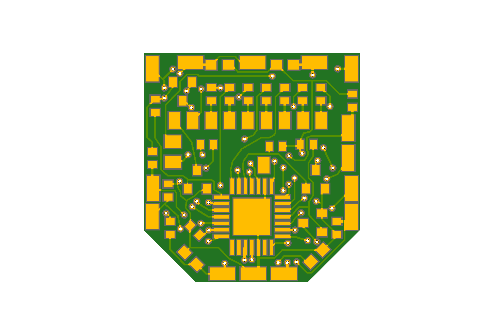
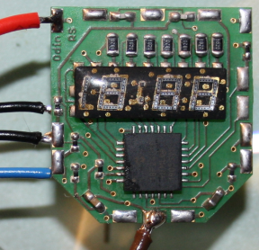
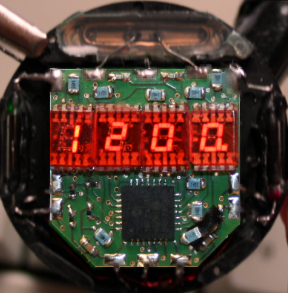

Open Source Pulsar P3 Replacement Module 'Odin' & 'Loki'
========================================================

This project bundles my source code, binary, schematics and PCB layout files for my own Open Source Pulsar P3 LED watch replacement modules. I do **not** sell those modules or any component and I do **not** do any repairs. This project is purely for the enthusiast, that want to fix a Pulsar LED watch himself or herself, that is far beyond repair otherwise. This project is **not** meant to be used commercially.

The PCB layout is made in a way, allowing it to be opened and edited with the free Eagle version. I prefer the older Eagle 6.6 release, that still was made by CADSoft.

The free trial version of the CAD-Soft Eagle software can be found on CAD-Softs's own FTP server:
ftp://ftp.cadsoft.de/eagle/program/6.6/

Module Types
============

This project contains two different boards. The **Odin** board, that can be used, if the **original Litronix** dotty LED display could be rescued. The **Loki** board can be used if the original display is broken and shall be replaced with four USSR made **AL304G replacement** single digit displays with common anodes. You can also compile the firmware binary for using ALS314A single digit displays with common cathodes instead. But these are much dimmer and I recommend to use AL304G with common anodes for better readability. If using the brighter AL304G displays use resistors with about 130 Ohms (AL304G). For the dimmer ALS314A digits with common cathodes use 100 Ohms instead (ALS314A). The original display on the 'Odin' board features 82 Ohms resistors. See the comments in the schematics.

License Agreement
=================

The software, source code, schematics, drawings and resources are provided to you by the Licensor under the License, as defined below, subject to the following condition.

Without limiting other conditions in the License, the grant of rights under the License will not include, and the License does not grant to you, the right to sell the software, source code, schematics, drawings or resources.

The Licensor does not grant the right to produce watch modules on the base of this work and then sell them as a product for profit.

These schematics, layout and source code files are free software; you can redistribute them and/or modify them under the terms of the GNU General Public License as published by the Free Software Foundation in version 2 of the License.

These source code, schematics, drawings and layout files are distributed in the hope that they will be useful, but WITHOUT ANY WARRANTY; without even the implied warranty of MERCHANTABILITY or FITNESS FOR A PARTICULAR PURPOSE. See the GNU General Public License for more details.

Hardware & Software
===================

This project features a MicroChip PIC18F24J11 MCU. The software can be compiled using Microchip's MPLAB IDE and the XC8 compiler. You can get those free for private use. To flash the controller I used a PICKIT™3 unit. You still get those units second hand or NOS but you can also use a more recent one.

**Module 'Odin' featuring the original display and light sensor.**

In the main header file, select the right type of watch module. You find also ready compiled binaries for the 'Odin' and 'Loki' module.

**Module 'Loki' featuring four replacement single digit displays and no light sensor.**

Important
==========
We do **not** do any repairs or deliver any components. This is a pure Open Source project, were I share my files, that I used to create a replacement module for one of my old watches, that was corroded beyond repair. This project shall not be used commercially.

Contributing
============
To contribute to this project you should submit your proposals to the maintainer via GitHub.

Maintainer
==========
Dipl.-Ing.(FH) Roy Schneider

Useful Information
==================

More information about old Pulsar LED watches, can be found here:

Pulsar LED Watch Forum:
http://www.oldpulsars.com/

PCB
===

If you order your PCB at some manufacturer, go for the 1mm material thickness, not more. You need a thin PCB to ensure, you have enough clearance to the watch case glass, when the display has been installed. A traces thickness of 35 µm is good enough. Order the PCB with a solder stop mask. That simplifies soldering a lot. You usually do not need a silk screen. Order ENIG (Electroless Nickel Gold) surface (traces) for best solder results.

Energy Consumption
==================

The watch currently draws about 8 µA (0.008 mA) of current, if the display is not lit up. Assuming your silver oxide batteries would have 160mAh, the battery life time would be about a year, depending how often you use the display. You may use Alkaline batteries but I suggest to use Silver Oxide batteries having 1.55V and a larger capacity.

Setting the Time & Date of the Replacement Module
=================================================

To forward the hours, place the magnet in the HOURS recess. To forward the minutes, place the magnet in the MINUTES recess. Keep in mind that the watch will stop counting the time, if you have forwarded the minutes, until you will press the first time the readout TIME button. This gives you an easy way to set the watch second-accurate, by setting the watch one minute into the future and then wait until the reference clock wraps to that very minute. If you press the TIME button in that moment, the watch will continue counting the time, having set the seconds to zero. To forward the month hold the DATE button pressed and place the magnet in the HOUR recess. To forward the day hold the DATE and TIME buttons pressed at the same time and place the magnet in the HOUR recess. This replacement module adds the weekday, the year and the light sensor read-out to the watch. Refer to the next chapter for setting them.

Settings the Extra Features of the Firmware not included in the original P3
===========================================================================

The firmware for this replacement module adds two additional functions to the watch. It adds the weekday and the year. To set the year hold the DATE and TIME button pressed and forward the year by putting the magnet into the MIN recess. To set the weekday hold only the DATE button pressed and forward the weekday by putting the magnet into the MIN recess. If you face the issue that you set the year instead of the weekday, then the magnet is very strong and engages not only the MIN but also the TIME reed contact. Try turning the magnet around in that case.

Optional Alarm Feature of the 'Loki Module'
============================================

This feature is only available for the 'Loki' modules, using the USSR made replacement displays. You can use the output RC2 of the micro controller in order to drive a disc piezo buzzer with a 820Ohm...1kOhm resistor in series. To use that feature turn the ALARM option on in the main.h header file and rebuild the binary.

**Note:**

Don't expect the alarm to be loud... it will not be loud enough to wake you up, simply because it is silenced by the massive metal case of the watch. :-)

**Set Alarm**

In order to set the alarm, press the TIME (hold) and then the DATE (hold) button in this exact order ands keep them pressed together. Now you can place the magnet in the HOUR or MIN recess to set the alarm.

**Toggle Alarm (on/off)**

To turn the alarm on or off press the TIME (hold) and then the DATE (hold) button in this exact order, then release the DATE button and press DATE again, while holding TIME still pressed, in order to toggle the alarm. A little dot on the right of the last AL304G display will indicate if the alarm is on or off.

Light Sensor Readout
====================

This applies only to the 'Odin' modules, if the light sensor option has been turned on. If you hold the DATE button pressed for more than a second, the watch will show the weekday and then, if you still keep the button pressed, the year. If you keep the button even longer pressed, a number will appear, that reflects the light sensor value. On normal daylight, that value shall be between two and four. On strong sun light five to six. If you are in dim light, the watch shall show one or zero. This readout is meant to make it easy to check, if the light sensor is working correctly.

Calibration
===========

The real-time crystal signal can be calibrated, so that the watch can provide an error of less than three seconds per month. If using the vintage original crystal, you will have easily 5 to 20 seconds drift per week, as those crystals are often hopelessly out tuned. By pressing the DATE button and holding it pressed, until the year or light sensor read out appears and then pressing the TIME button as well for a second, you will enter the drift calibration mode. You can now release the TIME button but keep the DATE pressed and use the magnet in the MIN recess to increase the calibration value. Use the HOUR recess to decrease the calibration value again. A positive value will speed up the watch by x\*0.6 seconds per week. A negative value will slow down the watch by x\*0.6 seconds by week. You can adjust the watch by a maximum ±38.76 seconds per week.
